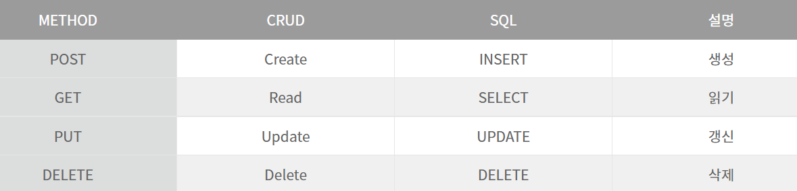
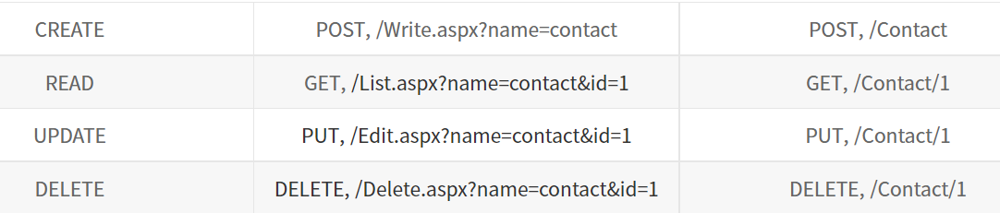

### Web APIs

 

#### API 란?

#### API는 Application Programming Interface의 약자로 응용 프로그램에서 사용할수 있도록, 운영체제나 프로그래밍 언어가 제공하는 기능을 제어할 수 있게 만드는 인터페이스를 뜻한다.

#### Web APIs 란?

#### 웹 서버 또는 웹 브라우저를 위한 애플리케이션 프로그래밍 인터페이스이다. HTTP 서비스이고 다양한 클라이언트에서 접근이 가능하도록 설계되어있다. Web 환경을 통해 제공되는 데이터 CRUD인터페이스를 제공한다.

#### REST 란?

#### REST는 Representational State Transfer의 약자이다. 자원을 URI로 표시하고 해당 자원의 상태를 주고 받는 것을 의미한다. REST는 URI를 통해 자원을 표시하고 HTTP METHOD를 이용하여 해당 자원의 행위를 정해주며 그 결과를 받는 것을 말한다.

#### REST의 구성요소

- 자원(Resource): URI
- 행위(Verb): HTTP METHOD
- 표현(Representations)

#### RESTful 란?

#### REST를 REST답게 쓰기 위한 방법으로 공식적이지 않은 개발자들이 비공식적으로 제시한 것이다. 이해하기 쉽고 사용하기 쉬운 REST API를 만드는 것이 목적이다.

#### RESTful 특징

- CRUD의 기능을 전부 활용해야한다. (ex. POST로만 모든 것을 처리하면 RESTFUL이 아니다.)
- URI에 자원과 id외 정보만 들어가야한다.

#### RESTful CRUD 메서드

#### URL

- 프로토콜: http, https, ftp 등
- 호스트네임: 도메인 or IP (서버컴퓨터의 이름 - 위치)
- URL path: 서버컴퓨터(host)에서 클라이언트가 요청한 파일 디렉토리
- 쿼리: 추가적 질문사항

#### URI

- Identifier: 식별자, 자원 식별자, id값(index)
- URI가 URL을 포함
- 예시: http://localhost/article/7 -> article(예를 들어 db 테이블 이름)이라는 db에 저장된 데이터 7번째 것을 나타냄

#### 즉, URL은 서버컴퓨터에서 클라이언트가 요청한 파일의 디렉토리를 나타내지만 URI는 자원의 고유 식별자(id값)이다.

#### RESTful API

#### HTTP code

 

##### 2xx 성공

##### 200: 클라이언트의 요청을 정상적으로 수행함.

##### 201: 클라이언트에게 생성 작업을 요청 받았고, 생성 작업을 성공함.

##### 204: 요청은 성공 했지만 응답할 콘텐츠가 없음.

 

##### 3xx 리다이렉션

##### 301: 클라이언트가 요청한 리소스에 대한 URI가 영구적으로 변경되었을 때 사용함.

##### 302: 301과 같으나 임시적으로 주소가 바뀌었을 경우 사용함.

##### 304: 이전에 방문했을 때의 요청 결과와 다르지 않을 경우 사용함. 캐시된 페이지를 그대로 사용.

##### 307: 임시 페이지로 리다이렉트.

 

##### 4xx 클라이언트 오류

##### 400: 클라이언트가 올바르지 못한 요청을 보냄.

##### 401: 로그인을 하지 않아 페이지를 열 권한이 없음.

##### 403: 금지된 페이지, 로그인을 하든 안하든 접근할 수 없음. (관리자 페이지)

##### 404: 찾을 수 없는 페이지, 주소를 잘 못 입력했을 때 사용함.

##### 403 대신에 사용할 수도 있음.(해커들의 공격을 방지하고자 페이지가 없는 것처럼 위장함)

##### 408: 요청 시간이 초과됨.

##### 409: 서버가 요청을 처리하는 과정에서 충돌이 발생한 경우. (회원가입 중 중복된 아이디인 경우)

##### 410: 영구적으로 사용할 수 없는 페이지.

 

##### 5xx 서버 오류

##### 501: 해당 요청을 처리하는 기능이 만들어지지 않음.

##### 502: 서버로 가능 요청이 중간에서 유실된 경우.

##### 503: 서버가 터졌거나 유지 보수 중

##### (유지 보수 중일때는 유지 보수중이라는 것을 알려주는 페이지로 전송해주는 것이 좋음)

##### 504: 서버 게이트웨이에 문제가 생겨 시간 초과가 된 경우.

##### 505: HTTP 버전이 달라 요청이 처리할 수 없음.

---

### Window Size

#### `window.screen: ${window.screen.width}, ${window.screen.height}`

#### 모니터의 해상도 너비, 높이

#### `window.outer: ${window.outerWidth}, ${window.outerHeight}`

#### 브라우저에 있는 URL,탭 창을 포함한 브라우저의 전체적인 사이즈

#### `window.inner: ${window.innerWidth}, ${window.innerHeight}`

#### 웹페이지(수직스크롤바가 있다면 스크롤바가 표기되는 모든것을 합한 페이지가 표기되는 부분 전체)

#### `documentElement.clientSize: ${document.documentElement.clientWidth}, ${document.documentElement.clientHeight}`

#### 웹페이지(수직스크롤바가 있다면 그 스크롤바를 제외한 영역 사이즈)
